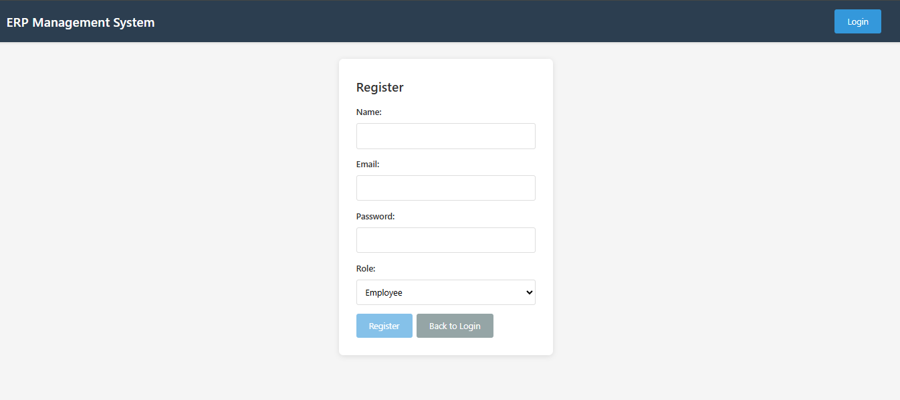

# Simple ERP


## 🚀 Project Overview

**Simple ERP** is a full-stack, containerized ERP (Enterprise Resource Planning) application built with the MEAN stack (MongoDB, Express.js, Angular, Node.js) and orchestrated with Docker. It provides a modular, scalable, and modern solution for managing products, customers, and orders, with authentication and role-based access control.

---

## ✨ Features
- **User Authentication** (JWT-based, role support)
- **Customer Management** (CRUD)
- **Product Management** (CRUD)
- **Order Management** (CRUD)
- **Responsive Angular Frontend**
- **RESTful API**
- **Nginx Reverse Proxy**
- **MongoDB Database**
- **Dockerized for Easy Deployment**

---

## 🏗️ Architecture

```
[ Angular Frontend ] <-> [ Nginx ] <-> [ Express/Node Backend ] <-> [ MongoDB ]
```
- All services run in isolated Docker containers and communicate via a Docker network.

---

## 🛠️ Quick Start

1. **Clone the repository:**
   ```bash
   git clone https://github.com/johndrubo/simple-erp.git
   cd simple-erp
   ```

2. **Configure environment variables:**
   - Copy `backend/.env.example` to `backend/.env` and update values as needed.

3. **Build and run with Docker Compose:**
   ```bash
   docker-compose up --build -d
   ```

4. **Access the app:**
   - Frontend: [http://localhost:8080](http://localhost:8080)
   - Backend API: [http://localhost:3000](http://localhost:3000)

---

## 📸 Screenshots





---

## 📚 Usage Examples

### Example: Fetch all customers (API)
```bash
curl http://localhost:3000/api/customers
```

### Example: Add a new customer (API)
```bash
curl -X POST http://localhost:3000/api/customers \
  -H "Content-Type: application/json" \
  -d '{"name":"Acme Corp","email":"info@acme.com"}'
```

---

## 🤝 Contributing

Contributions are welcome! Please fork the repo and submit a pull request. For major changes, open an issue first to discuss what you would like to change.

---

## ❓ FAQ
- **Where are environment variables stored?**
  - In `backend/.env` (not committed). See `.env.example` for a template.
- **How do I add more modules?**
  - Add new routes/models in the backend and new components/services in the frontend.
- **How do I reset the database?**
  - Stop containers, delete the `mongo-data` Docker volume, and restart.

---

## 🔗 Related Resources
- [MEAN Stack Documentation](https://mean.io/)
- [Docker Documentation](https://docs.docker.com/)
- [Angular](https://angular.io/)
- [Express.js](https://expressjs.com/)
- [MongoDB](https://www.mongodb.com/)

---

## 📄 License

This project is licensed under the MIT License.
